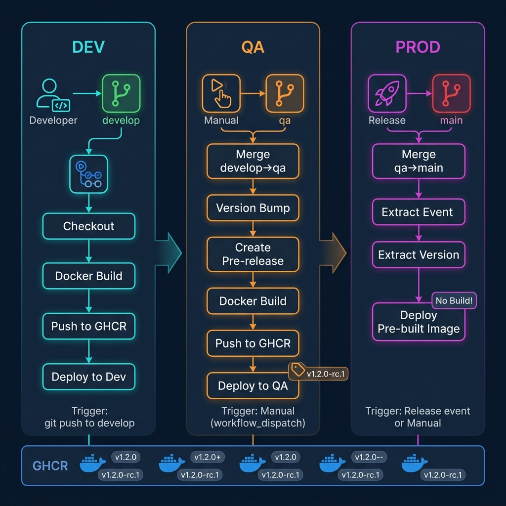
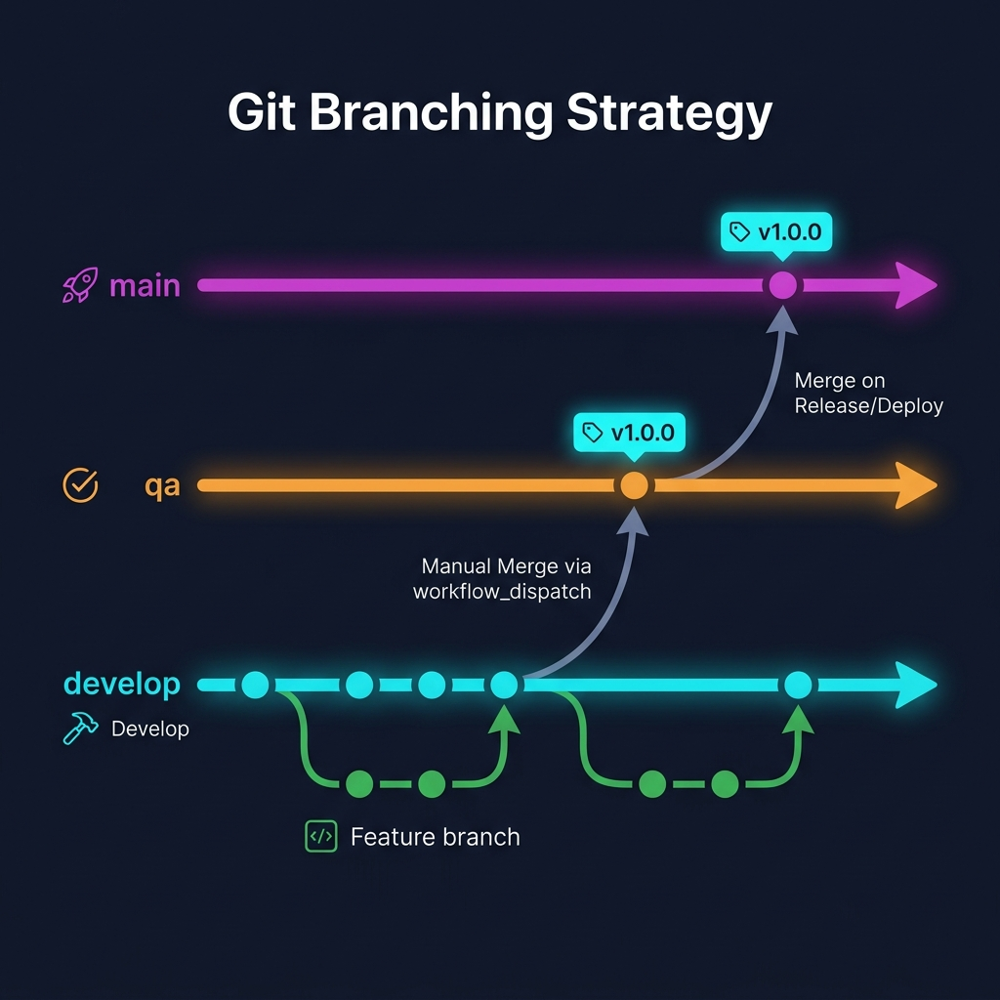
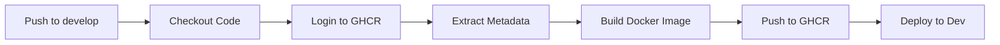
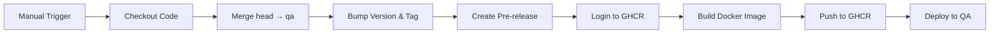
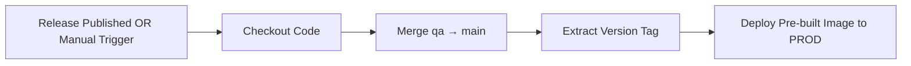
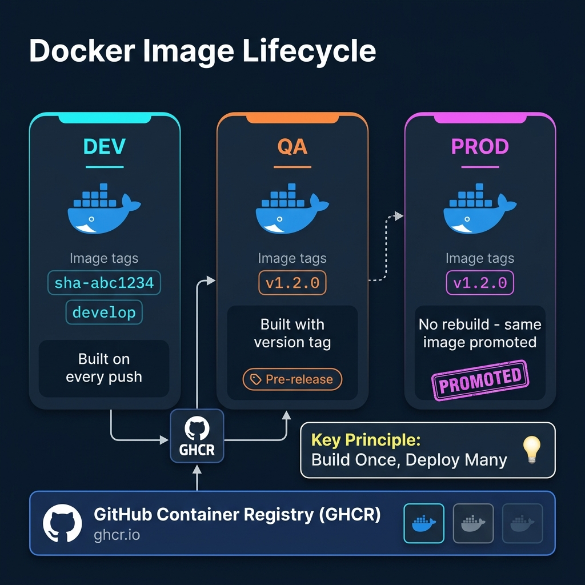

# 🚀 Release Pipeline — Dev to Prod

> A comprehensive guide to the branching strategy, CI/CD workflows, and environment promotion process used in this repository.

---

## Table of Contents

1. [Architecture Overview](#-architecture-overview)
2. [Branching Strategy](#-branching-strategy)
3. [Pipeline Stages](#-pipeline-stages)
   - [Dev Pipeline](#1-dev-pipeline)
   - [QA Pipeline](#2-qa-pipeline)
   - [Prod Pipeline](#3-prod-pipeline)
4. [Docker Image Lifecycle](#-docker-image-lifecycle)
5. [End-to-End Walkthrough](#-end-to-end-walkthrough)
6. [Workflow Triggers Reference](#-workflow-triggers-reference)
7. [GitHub Actions — Key Actions Used](#-github-actions--key-actions-used)
8. [Secrets & Permissions](#-secrets--permissions)

---

## 🏗 Architecture Overview

The release pipeline follows a **three-environment promotion model** where code flows from development through quality assurance and into production through a series of automated and manual gates.



### Key Design Principles

| Principle | Description |
|-----------|-------------|
| **Build Once, Deploy Many** | Docker images are built during Dev/QA and _promoted_ (not rebuilt) to Prod |
| **Immutable Artifacts** | Every QA build produces a semantically versioned, immutable container image |
| **Manual Promotion Gates** | QA and Prod deployments require explicit human approval via `workflow_dispatch` or GitHub Releases |
| **Branch-per-Environment** | Each environment maps to a dedicated long-lived branch (`develop`, `qa`, `main`) |

---

## 🌿 Branching Strategy

The repository uses three long-lived branches and short-lived feature branches:



### Branch Roles

| Branch | Purpose | Protected | Deployment Target |
|--------|---------|-----------|-------------------|
| `develop` | Active development — all feature branches merge here | Recommended | Dev Environment |
| `qa` | Quality assurance — receives merges from `develop` | Yes | QA / Staging Environment |
| `main` | Production-ready code — receives merges from `qa` | Yes | Production Environment |
| `feature/*` | Short-lived branches for individual features or fixes | No | None (local only) |

### Branch Flow

```
feature/my-feature ──► develop ──► qa ──► main
       │                  │          │        │
       │                  │          │        └── Production
       │                  │          └── QA / Staging
       │                  └── Development
       └── Developer's local work
```

### Rules

1. **Feature branches** are created from `develop` and merged back via Pull Request
2. **`develop` → `qa`** merges happen via the QA workflow (`workflow_dispatch`) — never directly
3. **`qa` → `main`** merges happen via the Prod workflow when a release is published — never directly
4. Direct pushes to `qa` and `main` should be blocked via branch protection rules

---

## ⚙ Pipeline Stages

### 1. Dev Pipeline

**File:** [`.github/workflows/dev.yml`](../.github/workflows/dev.yml)

| Property | Value |
|----------|-------|
| **Trigger** | `push` to `develop` branch |
| **Automation** | Fully automatic |
| **Builds image?** | ✅ Yes |
| **Creates release?** | ❌ No |
| **Deploys?** | ✅ Yes (Dev environment) |

#### Workflow Steps



#### Step-by-Step Breakdown

1. **Checkout** — Clones the repository at the pushed commit
2. **Login to GHCR** — Authenticates with GitHub Container Registry using `GITHUB_TOKEN`
3. **Extract Metadata** — Generates image tags:
   - `sha-<commit-sha>` (e.g., `sha-a1b2c3d`)
   - `develop` (branch name)
4. **Build & Push** — Builds the Docker image from the `Dockerfile` and pushes it to `ghcr.io/<org>/<repo>`
5. **Deploy** — Deploys the newly built image to the Dev environment

#### Image Tagging (Dev)

```
ghcr.io/<org>/release-pipelines:sha-a1b2c3d
ghcr.io/<org>/release-pipelines:develop
```

#### How to Trigger

```bash
# Automatic — just push to develop
git checkout develop
git add .
git commit -m "feat: add new feature"
git push origin develop
```

---

### 2. QA Pipeline

**File:** [`.github/workflows/qa.yml`](../.github/workflows/qa.yml)

| Property | Value |
|----------|-------|
| **Trigger** | Manual (`workflow_dispatch`) |
| **Automation** | Semi-automatic (manual trigger, automated execution) |
| **Builds image?** | ✅ Yes |
| **Creates release?** | ✅ Yes (Pre-release) |
| **Deploys?** | ✅ Yes (QA environment) |

#### Inputs

| Input | Description | Default | Options |
|-------|-------------|---------|---------|
| `head` | Branch to merge into QA | `develop` | Any branch |
| `bump` | Semantic version bump type | `patch` | `patch`, `minor`, `major` |

#### Workflow Steps



#### Step-by-Step Breakdown

1. **Checkout** — Clones the repository with full history (`fetch-depth: 0`)
2. **Merge** — Uses the GitHub API to merge the specified `head` branch (default: `develop`) into `qa`
3. **Version Bump** — Uses `github-tag-action` to create a new semantic version tag based on the selected bump type:
   - `patch`: `v1.0.0` → `v1.0.1`
   - `minor`: `v1.0.0` → `v1.1.0`
   - `major`: `v1.0.0` → `v2.0.0`
4. **Create Pre-release** — Creates a GitHub Pre-release tied to the new version tag
5. **Build & Push** — Builds the Docker image and pushes it to GHCR tagged with the version number
6. **Deploy** — Deploys the versioned image to the QA environment

#### Image Tagging (QA)

```
ghcr.io/<org>/release-pipelines:v1.2.0
```

#### How to Trigger

```bash
# Using GitHub CLI
gh workflow run qa.yml -f head=develop -f bump=patch

# Or via the GitHub Actions UI:
# Actions → QA Workflow → Run workflow → Fill inputs → Run
```

---

### 3. Prod Pipeline

**File:** [`.github/workflows/prod.yml`](../.github/workflows/prod.yml)

| Property | Value |
|----------|-------|
| **Trigger** | GitHub `release` event (type: `released`) OR manual `workflow_dispatch` |
| **Automation** | Manual trigger, automated execution |
| **Builds image?** | ❌ **No** — uses pre-built image from QA |
| **Creates release?** | ❌ No (uses existing release) |
| **Deploys?** | ✅ Yes (Production environment) |

> **⚠️ Key Point:** The Prod pipeline does **NOT** build a new Docker image. It promotes the exact same image that was tested in QA, ensuring environment parity.

#### Workflow Steps



#### Step-by-Step Breakdown

1. **Checkout** — Clones the repository
2. **Merge** — Uses the GitHub API to merge `qa` into `main`, synchronizing the production branch
3. **Extract Version** — Determines the version tag from either:
   - The release event name (`github.event.release.name`), or
   - The manual input (`github.event.inputs.releaseVersion`)
4. **Deploy** — Deploys the **pre-built** image `ghcr.io/<org>/release-pipelines:<version>` to Production

#### Image Tagging (Prod)

```
# Same image from QA — no rebuild!
ghcr.io/<org>/release-pipelines:v1.2.0
```

#### How to Trigger

**Option A — Via GitHub Release (Recommended):**
1. Go to **Releases** → **Draft a new release**
2. Select the version tag created during the QA pipeline (e.g., `v1.2.0`)
3. Write release notes
4. Click **Publish release** (not pre-release)
5. The `released` event automatically triggers the Prod workflow

**Option B — Via CLI / Manual Dispatch:**
```bash
gh workflow run prod.yml -f releaseVersion=v1.2.0
```

---

## 🐳 Docker Image Lifecycle



### Tagging Strategy Summary

| Environment | Tag Format | Example | Built? |
|-------------|-----------|---------|--------|
| Dev | `sha-<commit>`, `<branch>` | `sha-a1b2c3d`, `develop` | ✅ Yes |
| QA | `v<major>.<minor>.<patch>` | `v1.2.0` | ✅ Yes |
| Prod | `v<major>.<minor>.<patch>` | `v1.2.0` | ❌ No (reused) |

### The "Build Once, Deploy Many" Principle

```
┌─────────────────────────────────────────────────────────────────────┐
│                                                                     │
│   DEV BUILD                QA BUILD               PROD DEPLOY      │
│   ─────────                ────────               ───────────       │
│                                                                     │
│   Dockerfile ──► Image     Dockerfile ──► Image    Image (from QA)  │
│   (sha tag)                (version tag)           (same version)   │
│                                                                     │
│   Purpose:                 Purpose:                Purpose:          │
│   Fast feedback            Versioned artifact      Promote tested    │
│   for developers           for QA testing          image to prod     │
│                                                                     │
└─────────────────────────────────────────────────────────────────────┘
```

> **Why no rebuild in Prod?** Rebuilding in production introduces risk. The exact binary artifact tested in QA is the one deployed to production — guaranteeing what was tested is what runs.

---

## 🎯 End-to-End Walkthrough

Here is a complete example of shipping a feature from development to production:

### Step 1 — Develop a Feature

```bash
# Create a feature branch from develop
git checkout develop
git pull origin develop
git checkout -b feature/add-health-check

# Make changes, commit
git add .
git commit -m "feat: add /health endpoint"
git push origin feature/add-health-check
```

### Step 2 — Merge to Develop (via PR)

1. Open a Pull Request: `feature/add-health-check` → `develop`
2. Get code review approval
3. Merge the PR

> ✅ **Automatic:** The Dev pipeline triggers immediately on merge, building and deploying to Dev.

### Step 3 — Promote to QA

```bash
# Trigger QA workflow with a patch version bump
gh workflow run qa.yml -f head=develop -f bump=patch
```

**What happens:**
- `develop` is merged into `qa`
- Version is bumped (e.g., `v1.0.0` → `v1.0.1`)
- A pre-release `v1.0.1` is created on GitHub
- Docker image `ghcr.io/<org>/release-pipelines:v1.0.1` is built and pushed
- Image is deployed to the QA environment

### Step 4 — QA Testing

- QA team tests the deployed application in the QA environment
- If issues are found, fix them on `develop` and repeat from Step 2
- If tests pass, proceed to Step 5

### Step 5 — Release to Production

1. Go to GitHub **Releases**
2. Find the pre-release `v1.0.1`
3. Edit it → Uncheck "Pre-release" → Click **Publish release**

**What happens:**
- The `released` event fires
- `qa` branch is merged into `main`
- The **pre-built** image `v1.0.1` is deployed to Production
- No rebuild occurs — the same tested image is promoted

### Flow Summary

```
Developer → feature branch → PR → develop → [Auto: Dev Deploy]
                                      │
                                      ▼
                              [Manual: QA Workflow]
                                      │
                                      ▼
                               qa branch + tag → [Auto: QA Deploy]
                                      │
                                      ▼
                              [Manual: Publish Release]
                                      │
                                      ▼
                               main branch → [Auto: Prod Deploy]
```

---

## 📋 Workflow Triggers Reference

| Workflow | Event | Condition | Manual? |
|----------|-------|-----------|---------|
| Dev | `push` | Branch: `develop` | No |
| QA | `workflow_dispatch` | Inputs: `head`, `bump` | Yes |
| Prod | `release` (type: `released`) | When a release is published | No* |
| Prod | `workflow_dispatch` | Input: `releaseVersion` | Yes |

> *The `release` trigger fires automatically when someone publishes a release on GitHub, but publishing a release is itself a manual action.

---

## 🔧 GitHub Actions — Key Actions Used

| Action | Version | Purpose |
|--------|---------|---------|
| `actions/checkout` | v3 | Clone the repository |
| `docker/login-action` | v2 | Authenticate with GHCR |
| `docker/metadata-action` | v4 | Generate Docker image tags & labels |
| `docker/build-push-action` | v4 | Build and push Docker images |
| `octokit/request-action` | v2.x | Make GitHub API calls (merge, create release) |
| `anothrNick/github-tag-action` | 1.67.0 | Bump semantic version and create Git tags |

---

## 🔐 Secrets & Permissions

### Required Secrets

| Secret | Required By | Description |
|--------|-------------|-------------|
| `GITHUB_TOKEN` | All workflows | Auto-generated by GitHub Actions — no manual setup needed |

### Workflow Permissions

| Workflow | `contents` | `packages` | `pull-requests` |
|----------|-----------|-----------|----------------|
| Dev | `read` | `write` | — |
| QA | `write` | `write` | `write` |
| Prod | `write` | — | — |

---

## 📎 Quick Reference Card

```
┌─────────────────────────────────────────────────────────┐
│                   RELEASE PIPELINE                       │
├─────────────┬───────────────┬───────────────────────────┤
│     DEV     │      QA       │          PROD             │
├─────────────┼───────────────┼───────────────────────────┤
│ Branch:     │ Branch:       │ Branch:                   │
│  develop    │  qa           │  main                     │
├─────────────┼───────────────┼───────────────────────────┤
│ Trigger:    │ Trigger:      │ Trigger:                  │
│  git push   │  manual       │  release event / manual   │
├─────────────┼───────────────┼───────────────────────────┤
│ Builds:     │ Builds:       │ Builds:                   │
│  ✅ Yes     │  ✅ Yes       │  ❌ No (promotes QA img)  │
├─────────────┼───────────────┼───────────────────────────┤
│ Tags:       │ Tags:         │ Tags:                     │
│  sha + ref  │  semver       │  semver (reused)          │
├─────────────┼───────────────┼───────────────────────────┤
│ Release:    │ Release:      │ Release:                  │
│  ❌ None    │  Pre-release  │  Full release             │
└─────────────┴───────────────┴───────────────────────────┘
```

---

*Last updated: May 2026*
